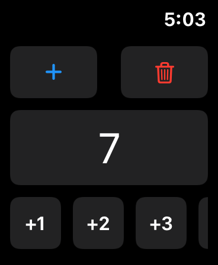
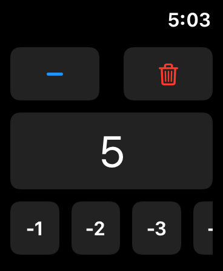
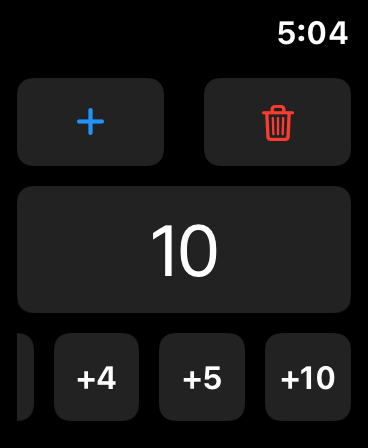

<h1 align="center">Countio | SwiftUI WatchOS App</h1>

---

  

<h2 align="center">App Screenshots</h2>

  ||

## What is Countio
Countio is simple WatchOS App made with Swiftly SwiftUI. You can count anything quickly with Countio!!!

## Resources
* [View On App Store](https://apps.apple.com/in/app/countio/id1510104828)
* [YouTube Tutorial](https://youtu.be/EWuTnjmEnHM)
* [Watch Preview](https://youtu.be/BBnCv3G8VgY)

## Features
* Count Anything Quickly
* Increase ? Decrease
* 6 Options To Count
* Switch Quickly +/-
* Remembers Every Last Count

## Requirements
* Xcode 11
* SwiftUI

## Contributions
Feel free to contribute to this SwiftUI WatchOS Project.

## License
**Countio** is MIT Licensed. See [LICENSE](LICENCE.txt) for more info.

## Project Admin

 
  
### **Dhanraj Chavan**

  

